<div align="center">

# ☕ Brewlucks

**A bilingual bistro & coffee bar site, with an animated WebGL/GSAP homepage on top of a real Supabase backend.**

[](https://brewlucks.brewlucks.workers.dev)

[](https://nextjs.org)
[](https://www.typescriptlang.org)
[](https://supabase.com)
[](https://tailwindcss.com)
[](https://threejs.org)
[](https://gsap.com)
[](https://workers.cloudflare.com)

<br/>

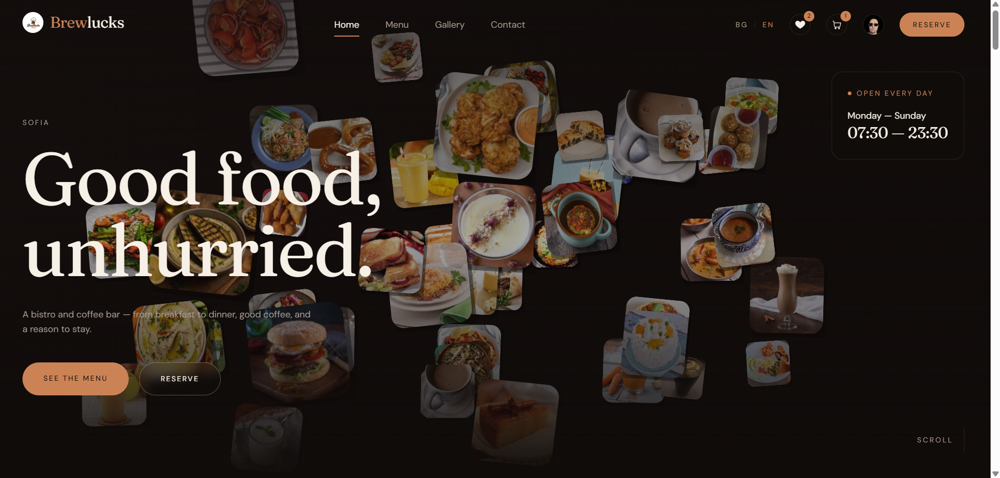

</div>

<br/>

Brewlucks is a portfolio/practice build for a fictional Sofia bistro & coffee bar, but the backend behind it is real, not mocked: real authentication, a real database, real image storage. It's bilingual (🇧🇬 Bulgarian / 🇬🇧 English), shows dual EUR/BGN pricing throughout, and ships a hand-built WebGL hero and several GSAP scroll-driven sections instead of a stock template look.

## ✨ Features

### 🎨 An animated, WebGL-powered homepage
- 🖼️ The hero background is a custom [`@react-three/fiber`](https://r3f.docs.pmnd.rs) scene: dozens of real menu photos float as GLSL-rendered planes (hand-rolled rounded corners + soft shadows, since WebGL has neither), drifting and reacting to scroll
- 🛡️ Resilient by design: each photo loads independently (a slow one never blanks the rest), the canvas is transparent over a CSS gradient (so there's never a flash of solid black), and it recovers from a dropped WebGL context instead of freezing
- 🎬 A pinned, scroll-scrubbed "signature dishes" strip and a vertical crossfade "From the bar" section, built with GSAP + ScrollTrigger
- 🕰️ A "we're open" hours card that stays fixed on screen for the whole homepage scroll

<div align="center">
<table><tr>
<td width="50%">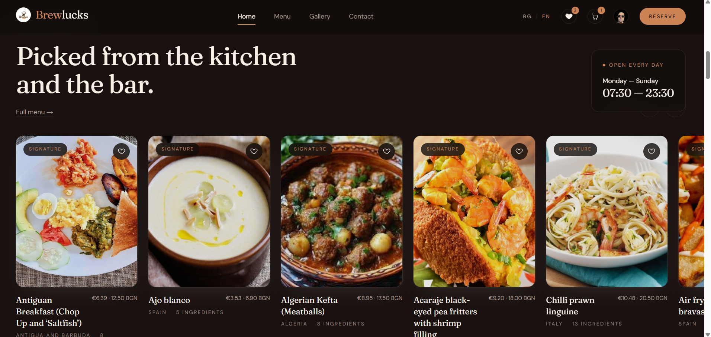</td>
<td width="50%">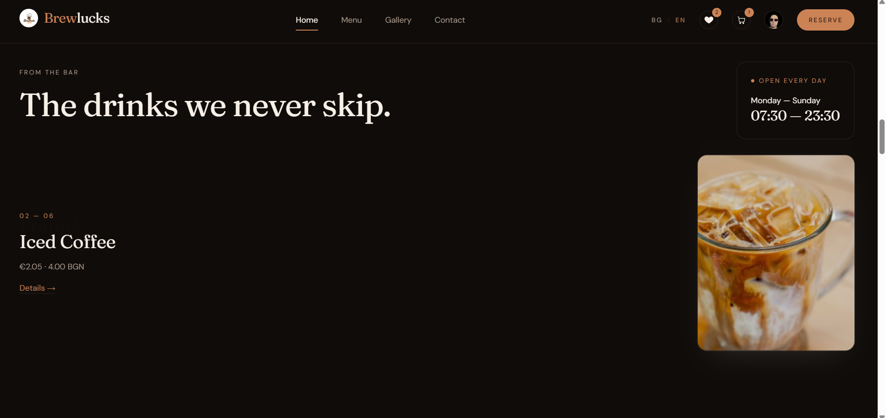</td>
</tr></table>
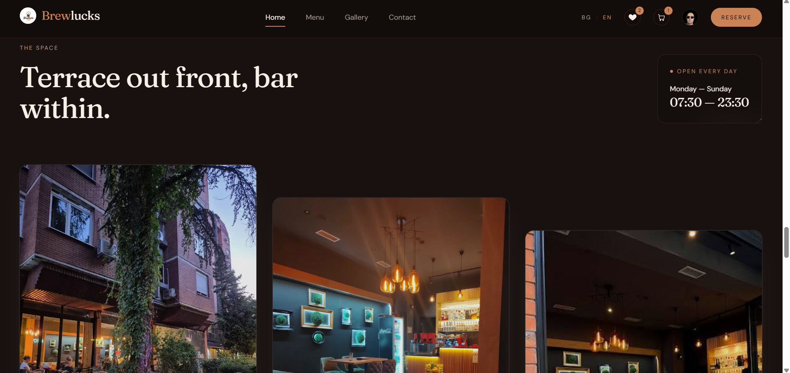
</div>

### 🍽️ Menu & product discovery
- 🔍 Full catalog with search, category filters, and sorting (category / price / name)
- 📂 A sticky sidebar + horizontally-scrollable category chips keep long lists easy to jump around in
- 🧾 Product detail pages with full ingredient lists, quantities, origin, and serving glass
- 💶 Dual-currency pricing (EUR / BGN) everywhere, and bilingual copy throughout (product names stay in their original language)

<div align="center">
<table><tr>
<td width="50%">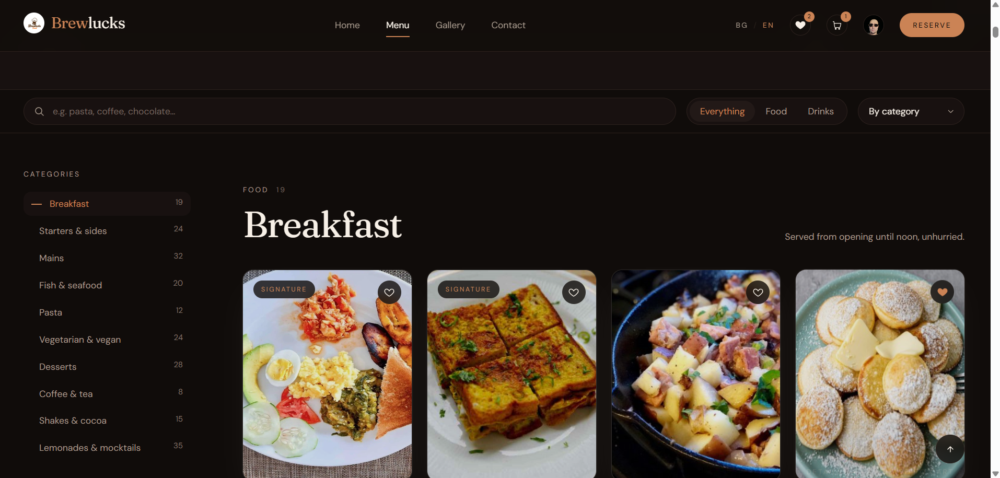</td>
<td width="50%">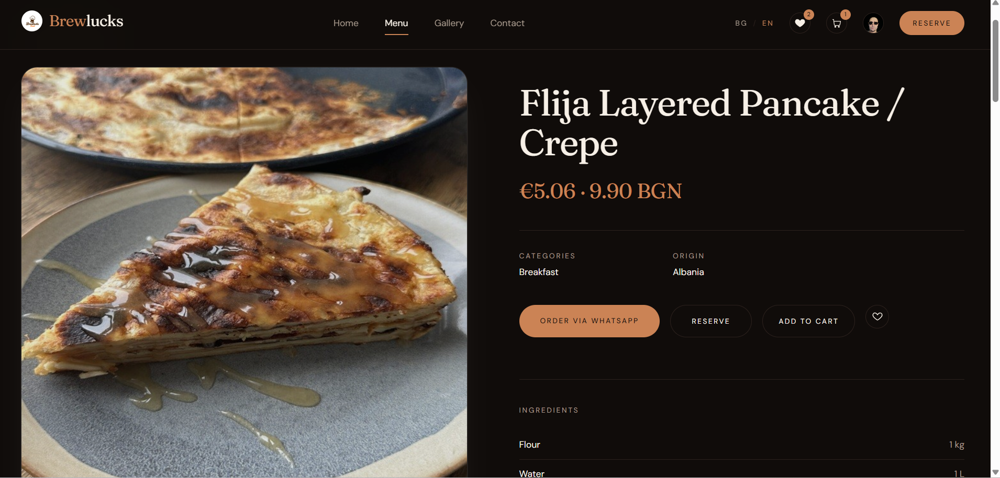</td>
</tr></table>
</div>

### ❤️ Favorites & 🛒 Cart
- Both **persist to your account** the moment you're signed in, and fall back to `localStorage` as a guest, merged automatically the first time you sign in
- Cart items are enriched (photo, origin/glass, price) and clickable straight through to the product page
- Checkout builds one aggregated WhatsApp message, and deliberately doesn't clear the cart afterwards since a sent message isn't proof the order actually went through

<div align="center">
<table><tr>
<td width="50%">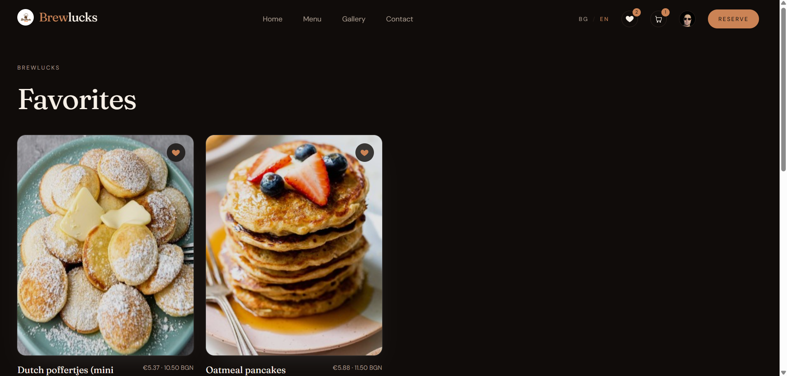</td>
<td width="50%">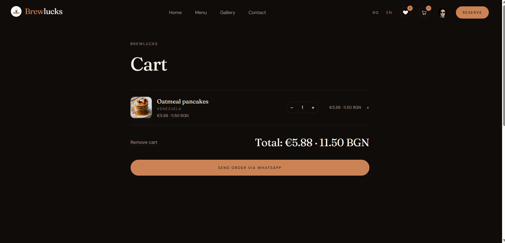</td>
</tr></table>
</div>

### 👤 Accounts & Auth
- 🔐 Supabase Auth: email/password **and** "Sign in with Google"
- ⚙️ Self-service profile editing: display name, phone, address, and an avatar upload straight to Supabase Storage
- 🗄️ `public.users` (not the OAuth session) is the durable source of truth the UI reads from, since Google silently re-syncs its own copy of your name/photo on every sign-in. The app never trusts that copy for display, only writes to it for anything else that might read it

<div align="center">
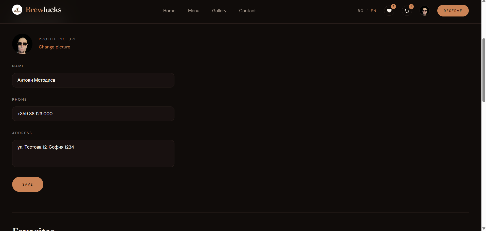
</div>

### 🖼️ Gallery & 📍 Contact
- A filterable photo gallery (food / drinks / the venue)
- A contact page with a WhatsApp-based form and an embedded Google Maps location

<div align="center">
<table><tr>
<td width="50%">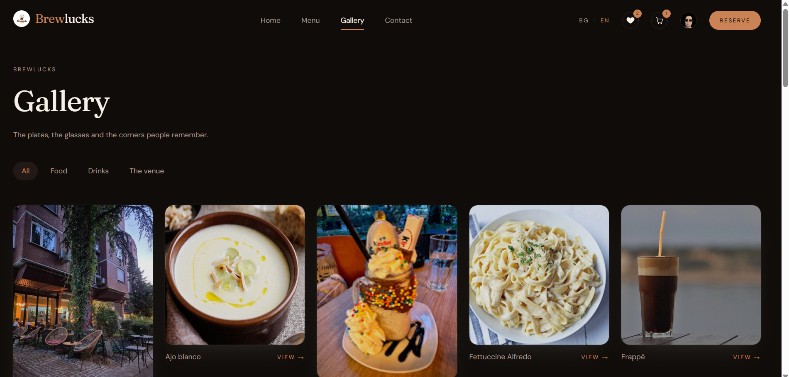</td>
<td width="50%">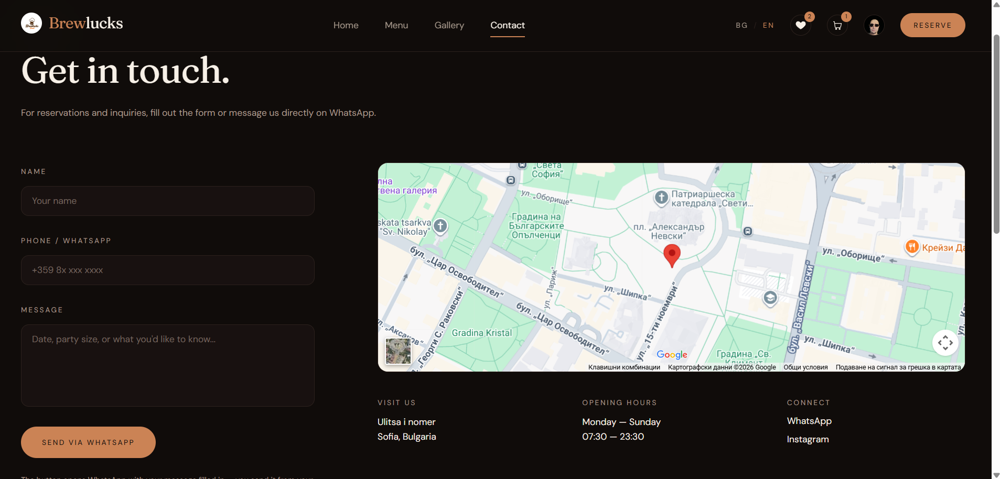</td>
</tr></table>
</div>

## 🧰 Tech Stack

| Layer | Technology |
|---|---|
| 🖼️ Framework | [Next.js 16](https://nextjs.org) (App Router, fully static/SSG) |
| 📘 Language | TypeScript |
| 🎨 Styling | Tailwind CSS v4 |
| 🌌 3D / WebGL | [Three.js](https://threejs.org) via [`@react-three/fiber`](https://r3f.docs.pmnd.rs), custom GLSL shaders |
| 🎬 Animation | [GSAP](https://gsap.com) + ScrollTrigger |
| 🗄️ Database, Auth & Storage | [Supabase](https://supabase.com) (Postgres + Row Level Security) |
| 💬 Ordering | WhatsApp Cloud API-style deep links (`wa.me`), no real payment processing |
| 🌍 i18n | Hand-rolled BG/EN dictionary + language context |
| ☁️ Deployment | Cloudflare Workers, via [`@opennextjs/cloudflare`](https://opennext.js.org/cloudflare) |
| 🌱 Catalog data | [TheMealDB](https://www.themealdb.com) + [TheCocktailDB](https://www.thecocktaildb.com) |

## 🚀 Getting Started

### Prerequisites
- Node.js 20+
- A [Supabase](https://supabase.com) project

### Setup

```bash
npm install
```

Create a `.env.local`:

```bash
DATABASE_URL=
NEXT_PUBLIC_SUPABASE_URL=
NEXT_PUBLIC_SUPABASE_PUBLISHABLE_KEY=
```

Set up the database (idempotent, safe to re-run) and seed the catalog:

```bash
npm run db:setup-auth              # users table + RLS policies + auth trigger
npm run db:setup-profile           # phone/address columns + avatars storage bucket
npm run db:migrate-cart-favorites  # cart/favorites jsonb columns on public.users
npm run db:seed                    # catalog, pulled from TheMealDB / TheCocktailDB
```

Start the dev server:

```bash
npm run dev
```

Open [http://localhost:3000](http://localhost:3000) 🎉

The app itself never talks to Supabase's Postgres connection directly at runtime: `predev`/`prebuild` hooks run `db:sync`, which snapshots the catalog into a committed JSON file that the site reads statically. This keeps the whole site servable as static assets and avoids exhausting Supabase's connection pool while building hundreds of product pages.

## ☁️ Deployment

Brewlucks deploys to **Cloudflare Workers** via [`@opennextjs/cloudflare`](https://opennext.js.org/cloudflare):

```bash
npm run preview   # build + run the Workers build locally
npm run deploy    # build + deploy to Cloudflare
```

## 📁 Project Structure

```
src/
  app/                    Pages (home, menu, product detail, cart, favorites, account, contact, gallery)
  components/             UI components, grouped by feature area (home, menu, cart, auth, layout, favorites)
  lib/
    catalog/               Static catalog data + generated JSON snapshot
    cart/                  Cart context (public.users-backed for signed-in users, localStorage for guests)
    supabase/               Auth session, profile, favorites contexts + Supabase client
    db.ts                  Postgres client, used ONLY by scripts/, never by the app itself
  i18n/                    BG/EN dictionaries + language context
scripts/                  One-off/idempotent setup & seed scripts (run against the live database)
```

## 📸 More Screenshots

<div align="center">
<table>
<tr>
<td width="33%">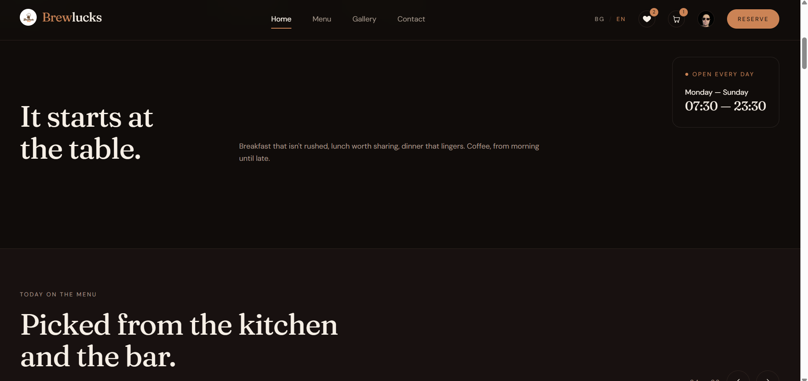<p align="center">Homepage statement section</p></td>
<td width="33%">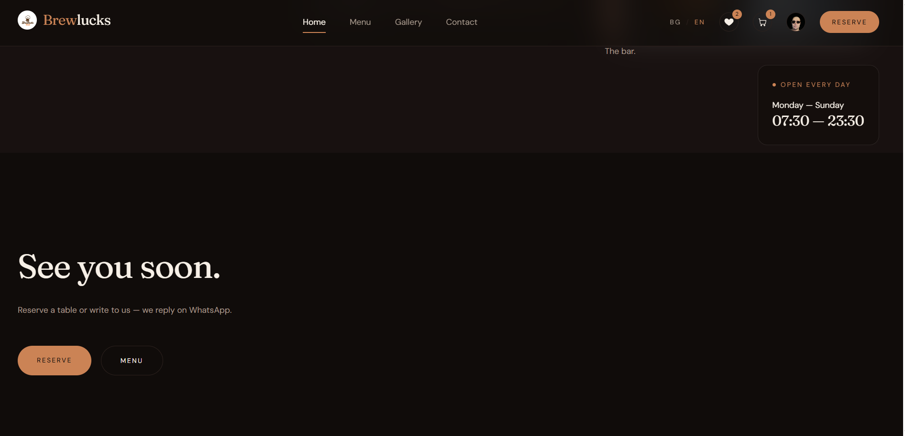<p align="center">Homepage reserve CTA</p></td>
<td width="33%">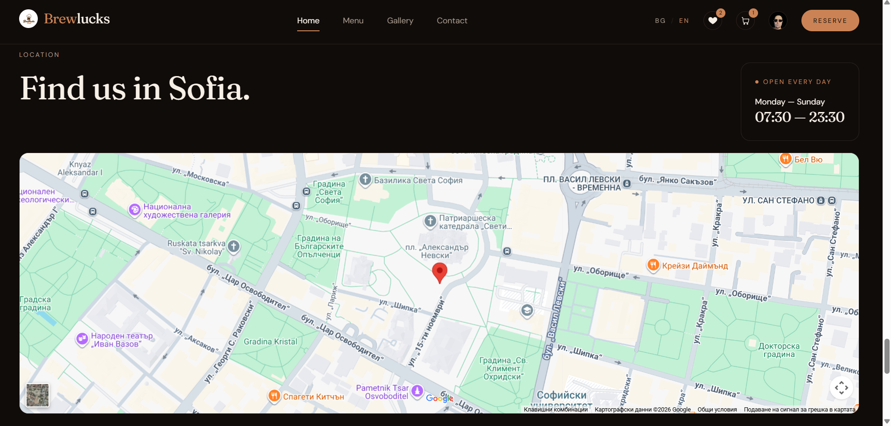<p align="center">Homepage find us section</p></td>
</tr>
<tr>
<td width="33%">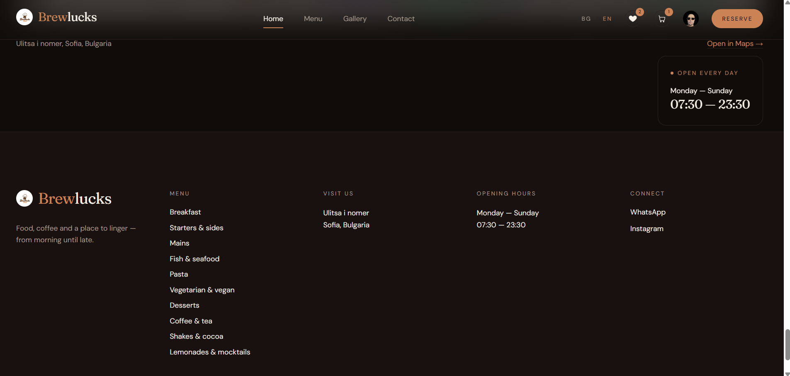<p align="center">Footer</p></td>
<td width="33%">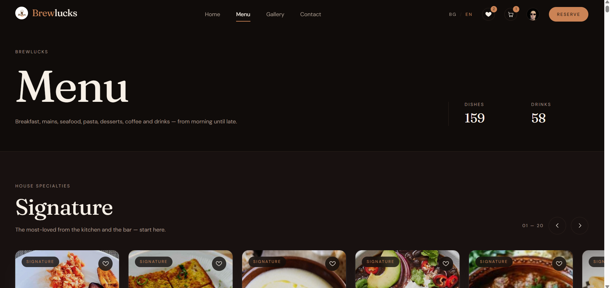<p align="center">Menu signature carousel</p></td>
<td width="33%">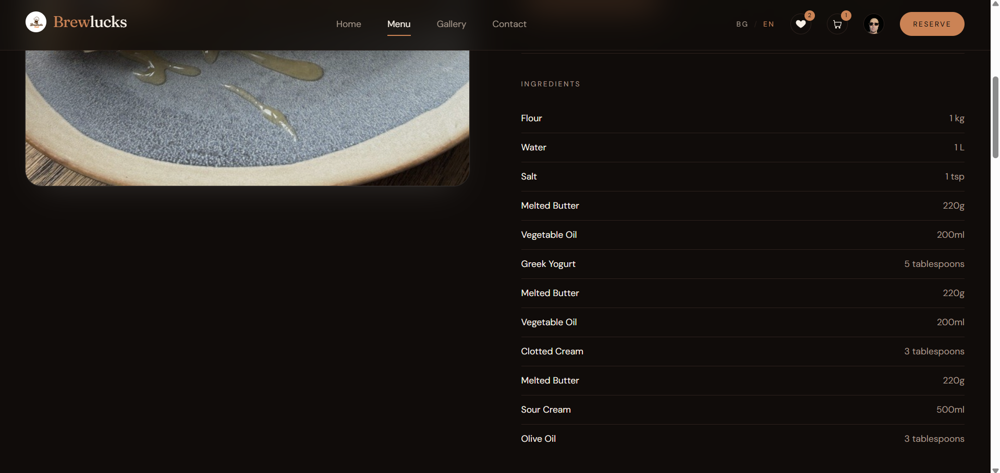<p align="center">Product detail ingredients</p></td>
</tr>
</table>
</div>

## 📝 Notes

- 🌱 Menu data is sourced from TheMealDB / TheCocktailDB for demo purposes; this is not a real restaurant's inventory.
- 💬 "Checkout" opens a prefilled WhatsApp message rather than processing a real payment; there's no Stripe/payment integration here by design.
- 📍 The address, phone number, and legal details on the contact/privacy pages are placeholders.

---

<div align="center">

Built as a hands-on exercise in shipping a real Supabase-backed app with a genuinely custom, animated front end: not a template, not mocked data.

</div>
